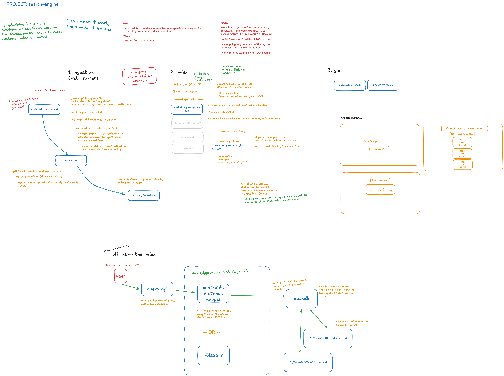

# Search-engine core

The following diagram/sketch outlines the thought process, attack plan, it lists constraints and draws a proposed architecture.



The grand idea is to divide the search-engine into 3 major areas: _ingestion_, _indexing_ and _frontend_

At its heart, there would be a 1PB index of documents and embeddings.
Data is stored in parquet files, convenient, compressed and simple, while sharding over multiple files to keep lookups fast.

Initially only embeddings are stored, for vector lookups. Lexical search (_ordinary BM25_) would come later.
The initial plan was to use DuckDB as glue, keeping operations simple and giving room to focus on the sciency-parts - which is where customer value is directly created.
Instead of setting up some elasticsearch or postgresql or chromadb cluster involving N-nodes times operation overhead.

Favoring DuckDB for HNSW distance calculations and keeping the embeddings did not work out as intended, so the current implementation is using a FAISS index. It was just too much of a mess.
Earlier plans involved deriving centroids off the embeddings, and using those to lookup shards that contain chunks that are similar to the query.
This way we didn't need to access all files (_please no full table scans!_) and could fetch only the 3 most relevant shards.
At first, estimates of the centroids table size would set it at some 20GB, but later these calculations turned out wrong.
The scraper repository still contains some old code around these early ideas.
Eventually, implementing it went south, and work moved to this repository.

Still building on the initial premises of low-operational overhead, DuckDB and embeddings.

## Indexing

The indexer reads _markdown_ content, chunks documents, computes embeddings and stores data in parquet files.

Embeddings are created using the `all-MiniLM-L6-v2` SentenceTransformer model.

We achieve PB index size scalability by sharding parquet files and using FAISS for fast shard and vector lookups.

We use `DuckDB` to access the required shards and use plain SQL to query relevant documents (web pages).

Once the required shard is identified, HTTP Range Requests are used (through DuckDB) to access the required data.

### HNSW

About the _Hierarchical Navigable Small Worlds (NHSW)_ index (FAISS):

> Small-world graph: each vector is a node; nodes are connected to a small number (M) of “neighbor” nodes, forming a proximity graph.
>
> Hierarchy of layers:
>
> Layer 0 contains all nodes.
> 
> Higher layers (1, 2, …) are progressively sparser subsets, chosen randomly.
> 
> Each node appears in all layers up to a randomly assigned maximum level.
> 
> Search procedure (for a query vector q):
> 
> Start at the top layer, with an entry point (often the first node inserted at that layer).
> 
> Greedy search: at each layer, walk the graph by moving to the neighbor closest to q, until no closer neighbor is found.
> 
> Drop down one layer and repeat, using the found node as the new entry point.
> 
> On layer 0, you do a best-first search with a candidate queue of size efSearch to explore a small frontier around that entry point and collect the top-K neighbors.
> 
> Because the graph has “short-cuts” linking distant regions, you find high-quality neighbors in O(log N) hops instead of scanning everything.

## Discussion

The index building itself is straight-forward and is (_or should be_) a grand display of architecture, of systems building and of working within constraints.
This ofcourse as a result of circling everything around parquet files, glued together with DuckDB and depending on something like S3.

Tough luck, it just didn't work out as intended.


## Query API

Since we use an HNSW we get to do distance calculations.

Inside `DuckDB` we can now compute distances between the query vector and the _semantic answer space_ in our index shards,
returning documents that are semantically close.

The plan was to include the BERT-based _rerankers_ library to rank the top results.
So the first 100 search results would come from the HNSW index, the vector embedding similarities, while _rerankers_ would be used to get to a more accurate topN, from which we'd take the very top 10. 

## Discussion

Rust would be better here, being compiled and all. It was faster to get something Python out the door, and get going.
A Rust rewrite would be something to explore once the index itself was done. So, essentially, never.

Since the API is stateless, we can simply scale out horizontally to keep up with user demand.

## Development

This `python` project is using `uv`.

Ingesting scraped data and building the index:

```bash
python3 build-index.py --input ../scraper/scraped_data --out-dir index
```

> The `scraped_data` dir is created in the _scraper_ project

Result:

```
Loading...
Prepping FAISS
Trained: False
Ingesting 1221 docs
Writing shard: index/shards/shard_0000.parquet
Saving FAISS index
Saving shards manifest
Built 4521 chunks, 1 shards, index at index/faiss/index.ivfhrt
```

To launch the `uvicorn` web api:

```bash
PYTHONPATH=./ uvicorn web:app --reload
```

And to run a query:

```bash
curl 'localhost:8000/v0/search?q=how+does+rust+print+to+console' | jq
```

Result:

```
[
  {
    "doc_id": 2,
    "chunk_id": 1,
    "url": "https://doc.rust-lang.org",
    "text": "[The Rust Style Guide](style-guide/index.html) describes the standard formatting\nof Rust code. Most ",
    "score": 0.8521055579185486,
    "time_ms": 65.93
  },
  {
    "doc_id": 2,
    "chunk_id": 0,
    "url": "https://doc.rust-lang.org",
    "text": "---\ntitle: Rust Documentation\n---\nWelcome to an overview of the documentation provided by the [Rust\n",
    "score": 0.8738031387329102,
    "time_ms": 65.93
  },
  {
    "doc_id": 156,
    "chunk_id": 0,
    "url": "https://docs.rs/x509-tsp/latest/x509_tsp/all.html",
    "text": "---\ntitle: List of all items\ndate: 2021-12-05\n---\nDocs.rs\nx509-tsp-0.1.0\nx509-tsp 0.1.0\nPermalink\nDo",
    "score": 0.936631977558136,
    "time_ms": 65.93
  },
  [..]
```

# Additional Resources

Chunking: https://arxiv.org/html/2410.13070v1#abstract

FAISS: https://github.com/facebookresearch/faiss/wiki

Rerankers: https://github.com/AnswerDotAI/rerankers
